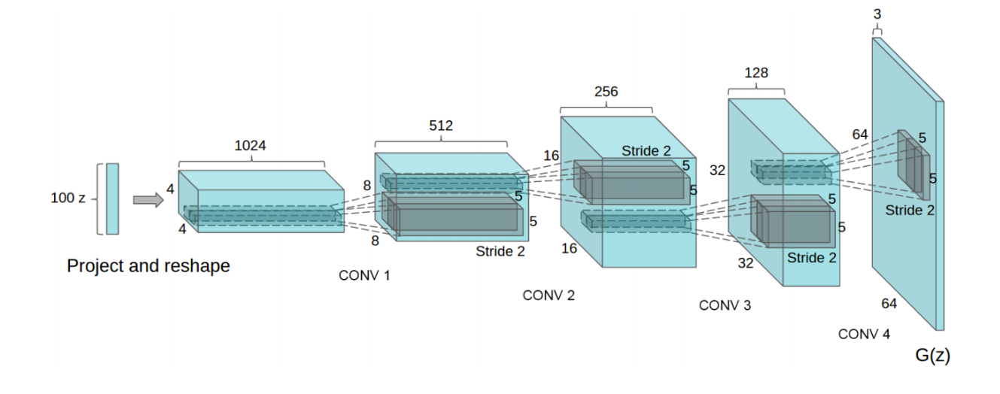
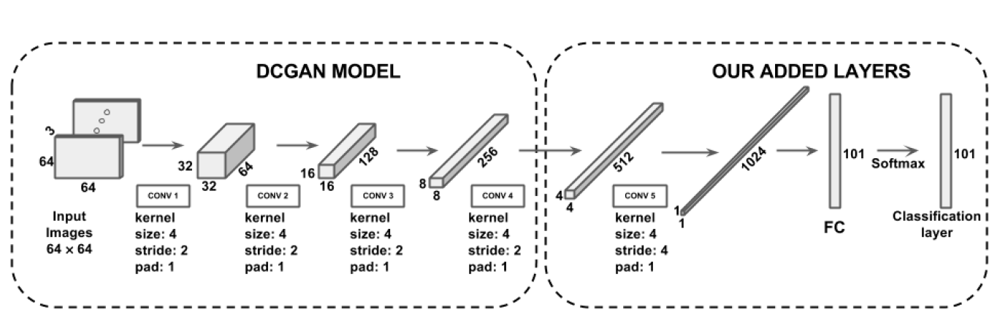

# DCGAN in Keras (Currently Working)

## Human Action Recognition on Video dataset(UCF 101).

Keras implementation of [Deep Convolutional Generative Adversarial Networks](https://arxiv.org/pdf/1801.07230.pdf) which is a stabilize Generative Adversarial Networks.

## Prerequisites

- Python 2.7 or Python 3.3+
- Keras
- [SciPy](http://www.scipy.org/install.html)
- Numpy
- Tqdm
- Tenserflow 

## Getting the data

First, download the dataset from UCF into the `data` folder:

`cd data && wget http://crcv.ucf.edu/data/UCF101/UCF101.rar`

Then extract it with `unrar e UCF101.rar`.

Next, create folders (still in the data folder) with `mkdir train && mkdir test && mkdir sequences && mkdir checkpoints`.

Now you can run the scripts in the data folder to move the videos to the appropriate place, extract their frames and make the CSV file the rest of the code references. You need to run these in order. Example:

`python 1_move_files.py`

`python 2_extract_files.py`  # make sure installed 'ffmpeg' before,eg. sudo apt-get install ffmpeg 

## Architecture

### Generator architecture

### Discriminator Architecture

###Citations

Khurram Soomro, Amir Roshan Zamir and Mubarak Shah, UCF101: A Dataset of 101 Human Action Classes From Videos in The Wild., CRCV-TR-12-01, November, 2012. 

[DCGAN Architecture](https://arxiv.org/abs/1511.06434)
