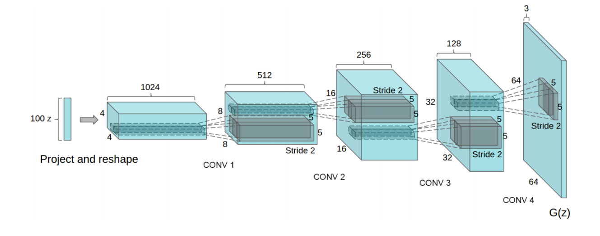
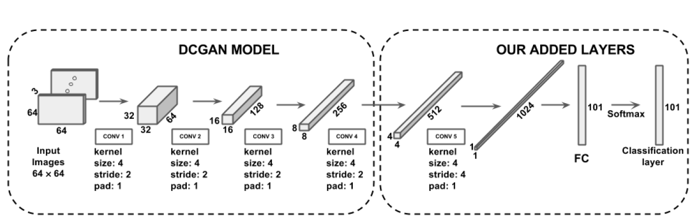

# DCGAN in Keras (Currently Working)

## Human Action Recognition on Video dataset(UCF 101).

Keras implementation of [Deep Convolutional Generative Adversarial Networks](https://arxiv.org/pdf/1801.07230.pdf) which is a stabilize Generative Adversarial Networks.

## Prerequisites

- Python 2.7 or Python 3.3+
- Keras
- [SciPy](http://www.scipy.org/install.html)
- Numpy
- Tqdm

## Architecture

The architecture referenced here was based on [DCGAN Architecture](https://arxiv.org/abs/1511.06434)

The added layer for the current architecture-

    

## Author
